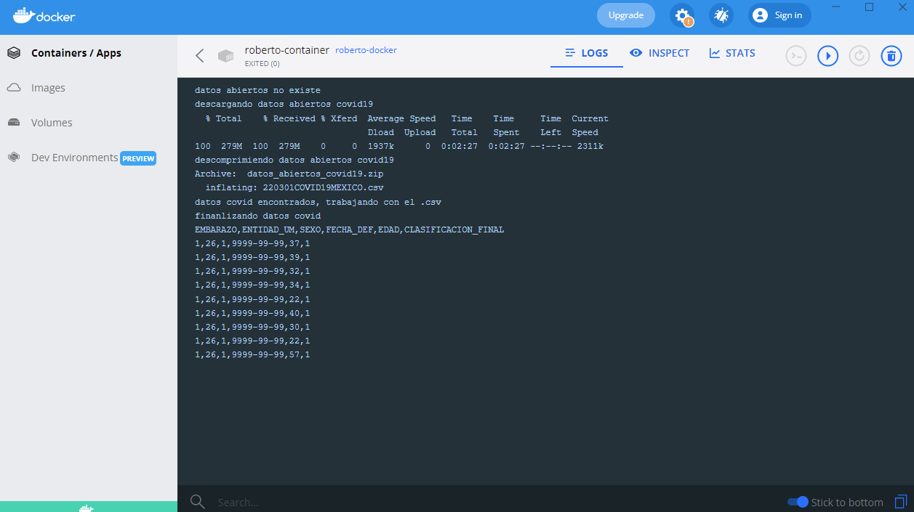

# COVID-19-Analysis
Downloading and analyzing COVID data

<!-- PROJECT LOGO -->
<br />
<p align="center">
  <a>
    
  </a>
</p>

  <p align="center">
       let's go!
    <br />
  </p>


<!-- TABLE OF CONTENTS -->
<details open="open">
  <summary>Table of Contents</summary>
  <ol>
    <li>
      <a href="#about-the-project">About The Project</a>
    </li>
    <li>
      <a href="#getting-started">Getting Started</a>
      <ul>
        <li><a href="#prerequisites">Prerequisites</a></li>
        <li><a href="#installation">Installation</a></li>
      </ul>
    </li>
  </ol>
</details>


<!-- ABOUT THE PROJECT -->
## About The Project

the following project shows how to analyze information about pregnant women who had convid in sonora.

Fields used of the database 210422COVID19MEXICO:
* EMBARAZO
* ENTIDAD_UM 
* SEXO
* FECHA_DEF 
* EDAD
* CLASIFICACION_FINAL  

### Data Souce Information

This section contains the link to COVID-19 cases in México, also you can download the files  .csv that can help you with additional information about to catalogs.
* [COVID19-DataSource](https://www.gob.mx/salud/documentos/datos-abiertos-152127)


<!-- GETTING STARTED -->
## Getting Started

This is an example of how you may give instructions on setting up your project locally.
To get a local copy up and running follow these simple example steps.

### Prerequisites

This is an example of how to list things you need to use the software and how to install them.
* you need have Installed Docker, you can find all information in: [Docker](https://docs.docker.com/get-docker/)
* you need have Installed Git, you can find all information in: [Git](https://git-scm.com/book/en/v2)

### Installation

1. Clone the repo
   ```sh
   git clone  https://github.com/RobertoLorenzoAguilar/COVID-19-Analysis.git
   ```
2. Build the docker image note: no forget the final dot ".", after the next command
   ```
   docker build -t ubuntu .
   ```
3. Create a new container "instance of the image"
   ```
   docker create -i --name ubuntu_container ubuntu
   ```
4. Start the container 
   ```
   docker start ubuntu_covid 
   ```
5. Run terminal the container 
   ```
   docker exec -it ubuntu_covid bin/bash
   ```


<!-- USAGE EXAMPLES -->
## Final

If all was fine you will find the **covid_size_reduction.csv** with the range of ages of a woman's with covid.

## P.S.
If you want to create the image and container also, you can use docker GUI   and catch the log of the process. Like in the below image
<p align="center">
  <a>
    
  </a>
</p>

